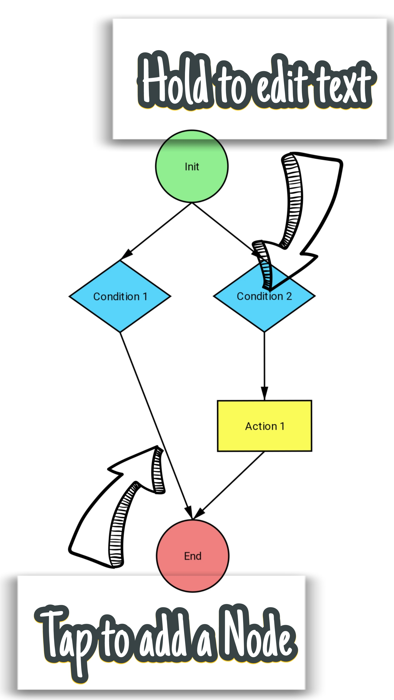

# Workflow App


Instructions for the Workflow app

## Running the App

### Development Environment

1. Clone the repository:
```sh
   git clone https://github.com/alvgomezv/workflow-app.git
```
2. Navigate to the repository:
 ```sh
   cd workflow-app
 ```
3. Install dependencies:
```sh
   npm install
 ```
4. Start the development server:
```sh
   npx expo start
 ```
5. Now follow the instructions to run the app.

   You can press "a" to run the Android emulator, "i" for the Ios emulator, or scan the QR code with the expo app to run it on your phone.
  
   If you are not using an Ios device, you can only use the Android emulator. ``(This app was design to run on Android only, but it can run on Ios devices too)``
   
   If you want to run this app on your phone, we recommend using:
    ``
    npx expo start --tunnel
     ``
### Development Environment

1. To build the aplication, follow the Expo Application Sevices (EAS) guide at:
```sh
   https://docs.expo.dev/eas/
```
--------------------------

## External Dependencies

- **React**: Chosen for its component-based architecture and strong community support (Application Requirement).
- **React Native**: Used for building native mobile applications using React (Application Requirement).
- **Expo**: Simplifies the development and deployment of React Native applications.
- **Expo Router**: Provides a robust navigation solution for React Native apps with Expo.


## Tools for Continuous Integration and Testing

- **Git**: Version control system. Used for tracking changes in the source code during software development.
- **GitHub**: Hosting service for Git repositories. Provides tools for collaboration, code review, and continuous integration.
- **Prettier**: Code formatter. Ensures consistent code style across the project.

## Architectural Choices

- **Component-Based Architecture**: React's component-based architecture allows for reusable and maintainable code.
- **Navigation**: Used Expo for its flexibility and ease of use with React Native. Used tabs as an easy way to navigate throught windows. Links were also usefull to access the workflows.
- **Expo**: Chosen for its ability to streamline the development process and provide a rich set of tools for React Native development.
- **Adjacency List (Graph) for Node Management**: Utilized an adjacency list to manage nodes and their connections efficiently. This choice allows for scalable and flexible representation of workflows, making it easier to add, remove, and traverse nodes.

## Future Considerations

- **Scalability**: The app is designed to be scalable, with a component-based architecture that allows for easy addition of new features.
- **Landscape Mode**: The app is designed to be used primarily in portrait mode to provide a consistent user experience. 
- **iOS-Based Specific Design**: The app includes design elements and considerations specific to iOS to ensure a native look and feel on Apple devices.
- **Longer text for shapes**: Implement support for longer text within shapes.
- **More advanced function to paint visual workflows**: Enhance the path drawing functionality to allow for more visual pleassing workflows atomatically.
- **Delete shapes with a form**: Add functionality to delete shapes using a form interface.
- **Edit and delete shapes**: Provide the ability to edit shapes and change their types.
- **Algorithm to recognize correct workflows**: Implement an algorithm to validate and recognize correct workflows.
- **Movable shapes**: Allow shapes to be moved around the canvas for better organization.
- **Possibility to add edges between other nodes (change the actual node structure)**: Enable the addition of edges between nodes, allowing for more flexible workflow structures.

--------------------------

## TASK LIST

### Set up project:

- [x] Test initialization of new Expo app
- [x] Install and test Virtual Devices with Android Studio and Expo
- [x] Run in a real device with Go
- [x] Create Git repository (automatic with Expo)

### Graphical Representation of Workflows

- [x] Testing libraries for shape representations
- [x] Choose library for shape representation
- [x] Create basic shapes as components
- [x] Paint basic shapes from data structure
- [x] Paint paths between shapes
- [x] View to paint the shapes based on coordinates object
- [x] Basic function to paint the paths based on coordinates of shapes
- [x] Function to resize the Canvas to the height and width of the workflow
- [x] Function to center de Canvas
- [x] Function to paint paths from the bottom to the top of the shapes
- [x] Make paths directional with an arrow
- [x] Improve design of shapes
- [x] Text for shapes
- [ ] (Extra) Longer text for shapes
- [ ] (Extra) More advance function to paint paths starting and ending from specific places of shapes

### Edit and Delete shapes

- [x] Make the text of the shapes editable
- [ ] (Extra) Delete shapes with a form
- [ ] (Extra) Edit shapes, changing them from action to condition and condition to action

### Workflow Data Structure

- [x] Try out different Data Structures
- [x] Choose one Data Structure for workflow and nodes
- [x] Create workflow object
- [x] Create node objects
- [x] Simple nodes (Init, End, Action) and conditional nodes
- [x] Function to create new nodes, simple and conditional, with input
- [x] Determine initial workflow structure
- tried with single node for conditionas, having problems
- [x] Double node for conditional
- [x] Funcion to create new nodes at any point of the workflow

### Interaction with Gestures

- [x] Move the workflow to all directions
- [x] Detect line that has been tapped
- [x] Tap a line to create new components
- [x] Zoom in an out the workflow view
- [x] Reset initial view with spring animation
- [x] Tap long a shape to edit its text
- [ ] (Extra) Tap long a shape to edit/delete shape

### Workflow Algorithms

- [x] Function to orginize the shapes by levels (Fix)
- [x] Function to organize shapes in the Canvas based on levels and give out a coordinates object (Basic tree structure)
- [ ] (Extra) Implement auto adjusting structure to paint the shapes in the workflow

### Basic Navigation

- [x] Workflow page
- [x] Navigation with tabs for more than one Workflow page
- [x] Create new Workflow pages in a new tab
- [x] Panel to go throw Workflow pages
- [x] Create new Workflow page button in the Panel
- [x] Delete Workflow button

### Session Management

- [x] Save workflow when closing the app
- [x] Saving all the workflows when closing the app

### Animations

- [x] Create an instructions panel shown at home page

### Automated Tests
